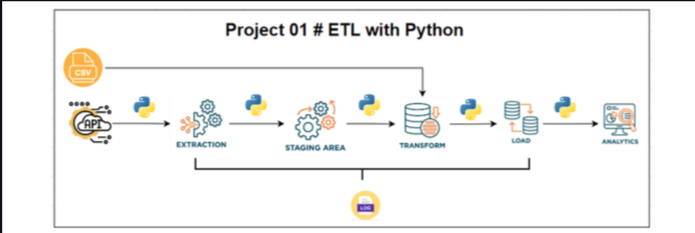

# 🏦 **ETL Pipeline: Largest Banks by Market Capitalization**  

##  **Overview**  
This project demonstrates a **mini ETL pipeline** built in **Python**.  

The pipeline:  
- **Extracts** the list of the world’s largest banks from **Wikipedia (archived page)**  
- **Transforms** the data with **currency conversion** (USD → EUR, GBP, INR)  
- **Loads** the final dataset into **CSV + SQLite database**  
- Allows querying with **SQL** for insights  

Perfect for **learning ETL concepts** and **showcasing data engineering skills**.  

---

##  **Features**  
✔ **Extract** banking data from Wikipedia (archived page)  
✔ **Load** exchange rate data from CSV  
✔ **Transform** market capitalization into **USD, EUR, GBP, INR**  
✔ **Save** clean dataset into **CSV + SQLite database**  
✔ **Query** the dataset using SQL for insights  

---

## 🏗️ **ETL Pipeline Architecture**  

